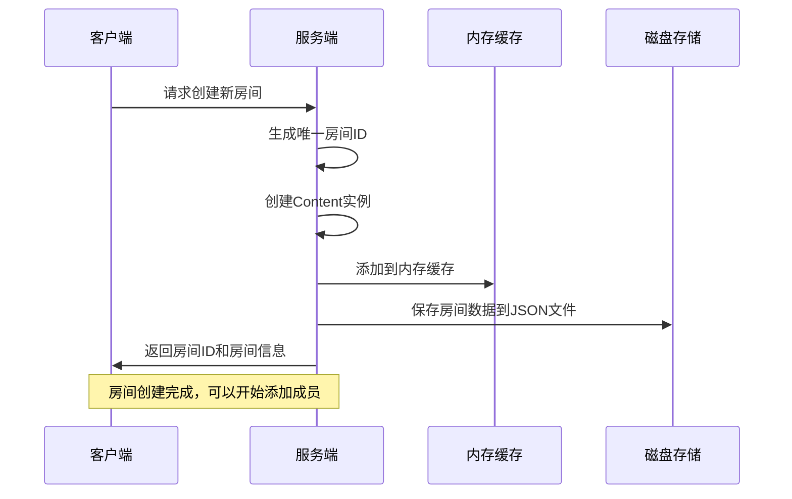
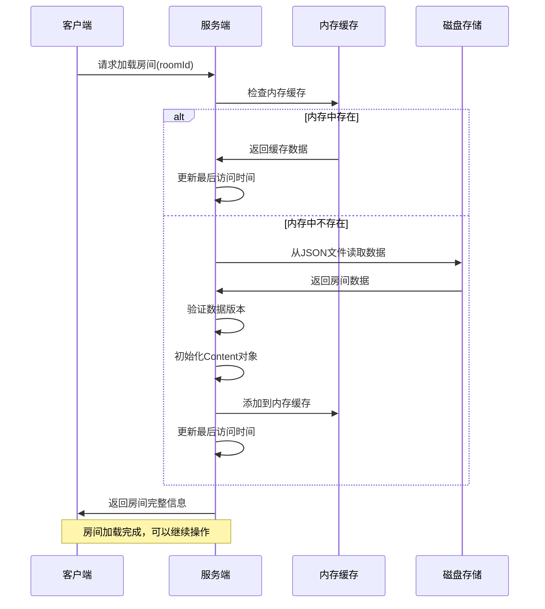
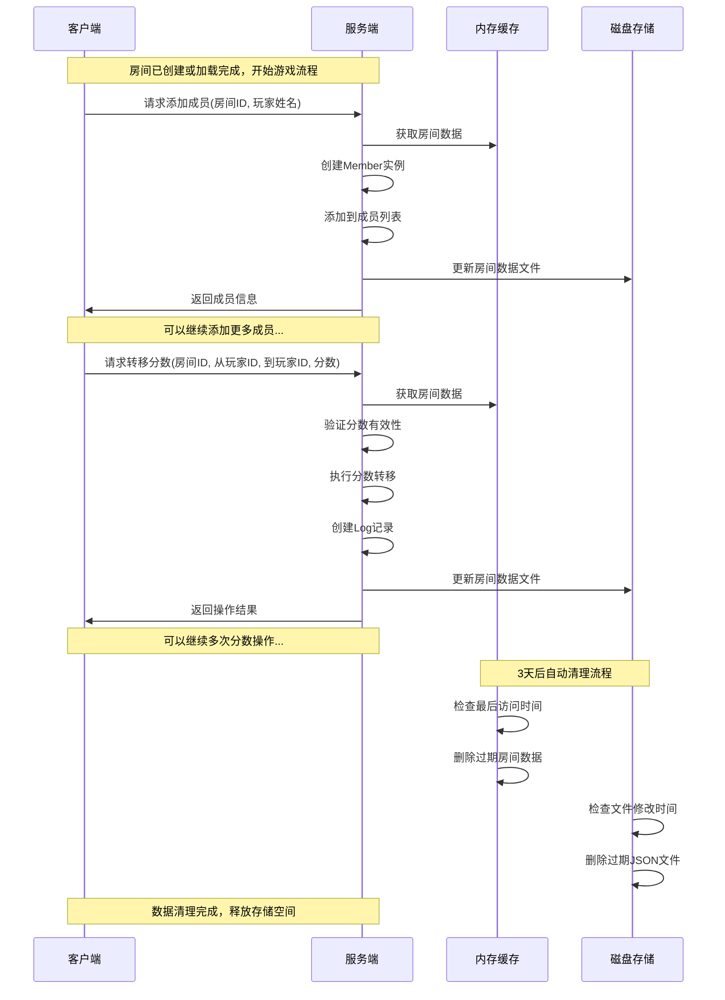

# Score Counter - 实时计分系统

一个轻量级的实时计分系统，支持多房间、多用户的分数管理和转移功能。

## 项目描述

Score Counter 是一个基于 TypeScript 和 Node.js 开发的实时计分系统，主要用于游戏、竞赛或团队活动中的分数管理。系统采用内存缓存 + 磁盘持久化的架构，确保数据的高效访问和可靠性。

### 核心功能

- 🏠 **多房间支持**：支持创建多个独立的计分房间
- 👥 **成员管理**：动态添加和管理房间成员
- 💰 **分数转移**：支持成员间的分数转移操作
- 📝 **操作日志**：记录所有分数转移历史
- 💾 **数据持久化**：自动保存到磁盘，支持数据恢复
- 🧹 **自动清理**：定期清理过期数据，节省存储空间

### 技术特性

- **内存缓存**：活跃房间数据缓存在内存中，提供快速访问
- **磁盘持久化**：数据自动保存到JSON文件，支持服务重启后恢复
- **数据版本控制**：支持数据格式升级和兼容性检查
- **自动清理机制**：3天后自动清理过期数据
- **唯一ID生成**：使用随机算法生成唯一的房间和成员ID

## 系统架构

```
┌─────────────────┐    ┌─────────────────┐    ┌─────────────────┐
│   客户端应用    │    │   服务端应用    │    │   数据存储层    │
│   (Web/移动端)  │◄──►│   (TypeScript)  │◄──►│   (JSON文件)    │
└─────────────────┘    └─────────────────┘    └─────────────────┘
                              │
                              ▼
                       ┌─────────────────┐
                       │   内存缓存层    │
                       │   (Map缓存)     │
                       └─────────────────┘
```

## 使用场景时序图

### 场景1：新建房间



### 场景2：加载老房间



### 场景3：游戏进行流程（房间就绪→玩家加入→分数操作→数据清理）



## 数据模型

### Member（成员）
```typescript
{
  id: string;      // 成员唯一标识
  name: string;    // 成员姓名
  score: number;   // 当前分数
}
```

### Log（操作日志）
```typescript
{
  fromMemberId: string;  // 转出分数的成员ID
  toMemberId: string;    // 转入分数的成员ID
  score: number;         // 转移的分数
}
```

### Content（房间内容）
```typescript
{
  version: string;           // 数据版本
  roomId: string;            // 房间ID
  members: Member[];         // 成员列表
  logs: Log[];               // 操作日志
  lastAccessTime: number;    // 最后访问时间
}
```

## 项目结构

```
score-counter/
├── README.md              # 项目说明文档
├── service/               # 服务端代码
│   ├── package.json       # 依赖配置
│   ├── tsconfig.json      # TypeScript配置
│   └── src/
│       └── main.ts        # 主要业务逻辑
└── web/                   # 前端代码
    ├── index.html         # 主页面
    └── index.js           # 前端逻辑
```

## 开发说明

### 环境要求
- Node.js 14+
- TypeScript 4+
- pnpm（推荐）或 npm

### 安装依赖
```bash
cd service
pnpm install
```

### 运行服务
```bash
cd service
pnpm start
```

## 数据存储

- **存储位置**：`service/data/` 目录
- **文件格式**：JSON
- **文件命名**：`{roomId}.json`
- **自动清理**：3天后自动删除过期文件
- **数据版本**：支持版本升级和兼容性检查

## 注意事项

1. 房间ID和成员ID使用随机算法生成，确保唯一性
2. 分数转移不支持负数或零值
3. 不能向自己转移分数
4. 数据文件会自动创建，无需手动初始化
5. 内存缓存会定期清理，提高系统性能